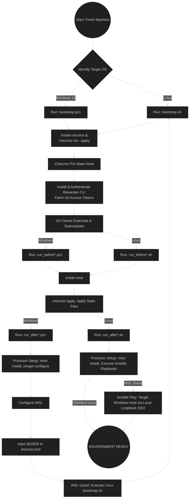

# Dotfiles Management System

> [!WARNING]
> This is a work in progress, current commit might be in a broken state

A dotfiles and system configuration management project using **chezmoi**, **mise**, and **Ansible**, with the goal to create an idempotent, declarative setup that allows for easy reproduction.

## Quick Start

### Linux / WSL

```bash
git clone https://github.com/OtavioLhamas/dotfiles.git ~/.local/share/chezmoi/
~/.local/share/chezmoi/bootstrap.sh
```

or

```bash
curl https://github.com/OtavioLhamas/dotfiles.git/bootstrap.sh | sh
```

### Windows 11 Native

Make sure you have the necessary execution policy:

```powershell
# Requires elevated privileges
Set-ExecutionPolicy -ExecutionPolicy Unrestricted -Scope LocalMachine
```

Enable winget configure:

```powershell
winget configure --enable
```

```powershell
git clone https://github.com/OtavioLhamas/dotfiles.git ~/.local/share/chezmoi/
~/.local/share/chezmoi/bootstrap.ps1
```

or

```powershell
irm https://github.com/OtavioLhamas/dotfiles.git/bootstrap.ps1 | iex
```

## Supported Platforms

Should work on any Debian, Ubuntu, or Fedora based distro, and Windows 11.

These are the specific versions I validated:

- Debian 13
- Ubuntu 24.04
- Ubuntu Server 24.04
- Pop!\_OS 22.04, 24.04
- Fedora 44 Workstation Live
- Windows 11 25H2
- WSL (Windows Subsystem for Linux)

- Desktop Environments: GNOME, COSMIC

## Architecture

| Tool | Purpose |
| ------ | --------- |
| **chezmoi** | Dotfiles management, machine classification prompts, bootstrap orchestration |
| **mise** | User-space development tool installation (languages, CLI tools) |
| **Ansible** | System-wide configuration, services, desktop environment settings |
| **WinGet DSC** | Windows native declarative package/configuration management |

## Testing

```bash
# Health checks
test/health-check.sh

# Dry runs
test/dry-run.sh
```

## Directory Structure

- `chezmoi/` — Chezmoi source state (dotfiles, scripts, hooks, templates)
- `ansible/` — Ansible playbooks, roles, group_vars, inventory
- `test/` — Health check and dry-run scripts

## Machine Classification

During `chezmoi apply`, you'll be prompted for:

- **Category** (multi-choice): work, personal, gaming, multimedia, development
- **Form Factor**: desktop, laptop, server
- **Desktop Environment** (Linux only): gnome, cosmic, kde, none

These classifications drive conditional dotfile installation and Ansible role selection.

## Package Installation Priority

1. **mise** — if available in registry (user-space tools)
2. **WinGet DSC** — on Windows native, if available
3. **Ansible roles** — system packages and configurations
4. **Chezmoi scripts** — anything not covered above, declared in `.chezmoidata/packages.yaml`

## Password Management

Bitwarden CLI (`bw`) is installed by the `read-source-state.pre` hook before dotfiles are fetched. Templates can use `{{ bitwardenFields ... }}` to retrieve secrets.

## Flowchart



## License

MIT
