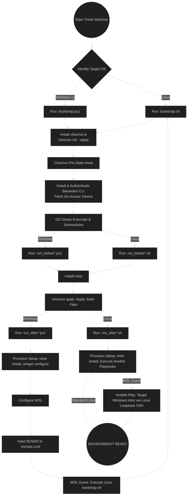

# Dotfiles Management System

> [!WARNING]
> This is a work in progress, current commit might be in a broken state

A dotfiles and system configuration management project using **chezmoi**, **mise**, and **Ansible**, with the goal to create an idempotent, declarative setup that allows easy reproduction.

## Quick Start

### Linux / WSL

```bash
git clone https://github.com/OtavioLhamas/dotfiles.git ~/.local/share/chezmoi/
~/.local/share/chezmoi/bootstrap.sh
```

or

```bash
curl https://github.com/OtavioLhamas/dotfiles.git/bootstrap.sh | sh
```

### Windows 11 Native

Some initial setup might be needed:

```powershell
# Allows the use of WinGet DSC
winget configure --enable

# Setup SSH so Ansible can reach the Windows host
Add-WindowsCapability -Online -Name OpenSSH.Client~~~~0.0.1.0
Add-WindowsCapability -Online -Name OpenSSH.Server~~~~0.0.1.0

# Start the sshd service
Start-Service sshd

# OPTIONAL but recommended:
Set-Service -Name sshd -StartupType 'Automatic'

# Confirm the Firewall rule is configured. It should be created automatically by setup. Run the following to verify
if (!(Get-NetFirewallRule -Name "OpenSSH-Server-In-TCP" -ErrorAction SilentlyContinue)) {
    Write-Output "Firewall Rule 'OpenSSH-Server-In-TCP' does not exist, creating it..."
    New-NetFirewallRule -Name 'OpenSSH-Server-In-TCP' -DisplayName 'OpenSSH Server (sshd)' -Enabled True -Direction Inbound -Protocol TCP -Action Allow -LocalPort 22
} else {
    Write-Output "Firewall rule 'OpenSSH-Server-In-TCP' has been created and exists."
}

```

```powershell
# Requires elevated privileges
Set-ExecutionPolicy -ExecutionPolicy Unrestricted -Scope LocalMachine
```

Then, finally:

```powershell
# Run on a regular, non-elevated shell
git clone https://github.com/OtavioLhamas/dotfiles.git ~/.local/share/chezmoi/
~\.local\share\chezmoi\bootstrap.ps1
```

or

```powershell
irm https://github.com/OtavioLhamas/dotfiles.git/bootstrap.ps1 | iex
```

## Supported Platforms

Should work on any Debian, Ubuntu, or Fedora based distro, and Windows 11.

These are the specific versions I validated:

- Debian 13
- Ubuntu 24.04
- Ubuntu Server 24.04
- Pop!\_OS 22.04, 24.04
- Fedora 44 Workstation Live
- Windows 11 25H2
- WSL (Windows Subsystem for Linux)

- Desktop Environments: GNOME, COSMIC
- Display Server: Wayland, X11

## Architecture

Provisioning is organized around **dependency layers** (phases), not around tools. Each phase only depends on previous phases.

| Phase | Layer | Mechanism |
|-------|-------|-----------|
| **0** | Bootstrap | `bootstrap.sh` / `bootstrap.ps1` — installs chezmoi only |
| **1** | Native toolchains | `hooks.read-source-state.pre` — compilers, build tools, dev libraries (read from declarative files) |
| **2** | Language runtimes & package managers | `run_once_before_` installs mise; dotfiles deployed; `run_onchange_after_` runs `mise install` / `winget configure` with change detection |
| **3** | System configuration | `run_onchange_after_` for simple packages; `run_after_` for Ansible (multi-step/repo-dependent roles) and WSL setup |

| Tool | Purpose |
|------|---------|
| **chezmoi** | Dotfiles management, machine classification prompts, phase orchestration |
| **mise** | User-space development tool installation (languages, CLI tools) |
| **Ansible** | System-wide configuration requiring multi-step setup (repos, GPG keys, flatpaks, services) |
| **WinGet DSC** | Windows native declarative package/configuration management |

## Testing

```bash
# Health checks
test/health-check.sh

# Dry runs
test/dry-run.sh
```

## Directory Structure

- `chezmoi/` — Chezmoi source state (dotfiles, scripts, hooks, templates)
- `ansible/` — Ansible playbooks, roles, group_vars, inventory
- `test/` — Health check and dry-run scripts

## Machine Classification

During `chezmoi apply`, you'll be prompted for:

- **Category** (multi-choice): work, personal, gaming, multimedia, development
- **Form Factor**: desktop, laptop, server
- **Desktop Environment** (Linux only): gnome, cosmic, kde, none

These classifications drive conditional dotfile installation and Ansible role selection.

## Package Installation Strategy

- **requirements.yaml** — Phase 1: native toolchains (compilers, build tools, dev libraries)
- **mise config.toml** — Phase 2: language runtimes and CLI tools
- **WinGet DSC** — Phase 2: Windows native packages
- **packages.yaml** — Phase 3: simple `apt/dnf install` packages from default repos (htop, flameshot, qbittorrent)
- **Ansible** — Phase 3: multi-step installations requiring repo setup, GPG keys, flatpaks, or post-install handlers

## Password Management

Bitwarden CLI (`bw`) is installed by the `read-source-state.pre` hook before dotfiles are fetched. Templates can use `{{ bitwardenFields ... }}` to retrieve secrets.

## Flowchart



## License

MIT
